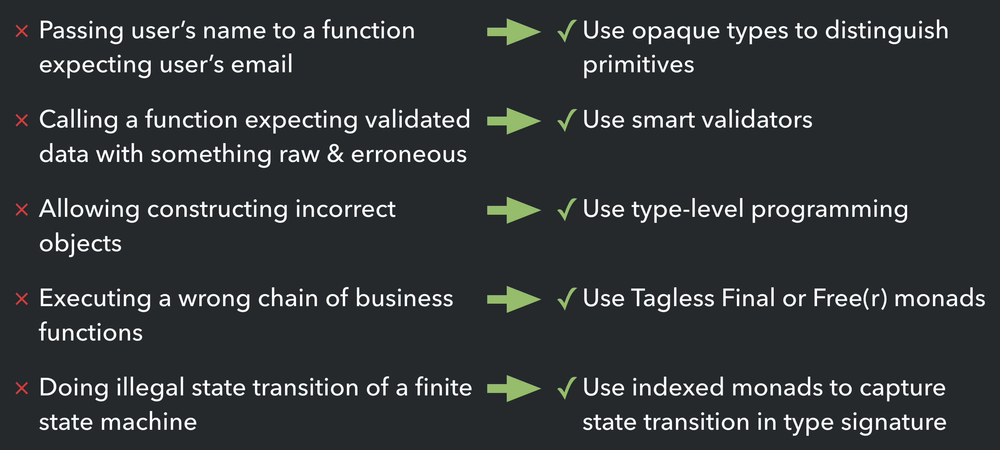

In this article I present "making illegal states unrepresentable" approach to modelling business domains in TypeScript. The article is based on the talk I gave at ZED Conference, and covers topics like opaque types, type-level programming, Tagless Final and indexed monads.

<!--more-->

# What is an illegal state?

From my perspective, an illegal state is such state of an application in which it demonstrates an unexpected behaviour, makes its data inconsistent, or cannot proceed with operation. Examples of illegal states:
- Passing user’s name to a function expecting user’s email;
- Calling a function expecting validated data with something raw & erroneous;
- Allowing constructing objects which are incorrect from business perspective;
- Executing a wrong chain of business functions — e.g., making double write-off;
- Doing illegal state transition of a finite state machine.

In order to deal with such behaviour we can take an approach of **making illegal states unrepresentable**.

> Making illegal states unrepresentable is a way of **statically** proving that all **runtime** values correspond to **valid** objects in the business domain.

A good starter example of this principle would be a `NonEmptyArray` — a static way of telling the compiler that functions we write require a non-empty arrays as arguments. In TypeScript this idea is expressed quite simply:

```ts
interface NonEmptyArray<A> extends Array<A> {
  0: A;
}
```

Using this type, we can statically ensure that our functions are not called with empty arrays:

```ts
// a function to extract a head (first element) of an array:
const head = <A>(arr: NonEmptyArray<A>): A => arr[0]; // statically known to be `A`, not `A | undefined`!

const first = head([1, 2, 3, 4]); // first :: number, first == 1
const error = head([]); // ❌ will fail to compile: Property '0' is missing in type '[]'
```

You may be curious: how do we create `NonEmptyArray` from a dynamically filled array, for example, when it's read from the disk or obtained using the network? In this case one of the next topics comes into play — a so-called "smart constructor" for `NonEmptyArray` can return its instance <abbr title="if and only if">iff</abbr> the underlying array's length is greater than zero. We use `Option` to express the idea of possibly missing result:

```ts
import { option } from 'fp-ts';
import type { Option } from 'fp-ts/Option';

// A constructor for a `NonEmptyArray`:
const fromArray = <A>(arr: A[]): Option<NonEmptyArray<A>> => arr.length > 0 ? option.some(arr) : option.none;
```

We will meet this approach of wrapping the results in either `Option` or `Either` later on. Meanwhile, let's switch to another topic and talk about making primitive types distinguishable one from another.

# Smart Validators and Opaque types

## Opaque types

Let's imaging we're working in a e-commerce domain, and writing a function which does something with a user ID and an order ID — say, checks in the database whether given order belongs to the given user. Both user ID and order ID are modelled as UUIDs, so we write a function:

```ts
const doesOrderBelongsToUser = (userId: string) => (orderId: string): Promise<boolean> => ...;
```

Then a time passes, the system evolves, and we want to do a refactoring. For expressiveness reasons we decide to swap the parameters:..

```ts
const doesOrderBelongsToUser = (orderId: string) => (userId: string): Promise<boolean> => ...;
```

...and **bam!**, we have to manually search for each and every reference to this function (including even the most obscure), and check if its arguments are really swapped. In order to make this task a bit simpler, it's better to differentiate various kinds of primitive types like strings, numbers, or booleans one from another.

And this is a job for opaque types! Opaque type is a type which wraps another type at the compile time, but has no runtime overhead. General ideal is somewhat reminiscent of a mixin — we "embellish" a primitive type with a compiler-level tag, which should be globally unique. Fortunately, TypeScript has a `unique symbol` type, which we will use for this task. Due to lack of nominal typing in TypeScript implementing opaque types will require some twiddling with namespaces — we'd want to hide symbol used for tags from an end-user.

```ts
namespace Tag {
  declare const OpaqueTagSymbol: unique symbol;
  declare class OpaqueTag<S extends symbol> {
      private [OpaqueTagSymbol]: S;
  }
  export type OpaqueType<T, S extends symbol> = T & OpaqueTag<S>;
}

export type Opaque<T, S extends symbol> = Tag.OpaqueType<T, S>;
```

Final usage will look like this: first we define or declare a unique symbol for the opaque type, and then apply `Opaque` geenric to the base type and this tag:

```ts
// Either define:
const UserIdS = Symbol.for('UserId');
// ...or declare a tag symbol:
declare const UserIdS: unique symbol;

// UserId type will be unassignable to other opaque types, but will be assignable to strings:
type UserId = Opaque<string, typeof UserIdS>;
```

Now we can implement the `doesOrderBelongsToUser` in a type-safe manner:

```ts
const UserIdS = Symbol.for('UserId');
type UserId = Opaque<string, typeof UserIdS>;

const OrderIdS = Symbol.for('OrderId');
type OrderId = Opaque<string, typeof OrderIdS>;

const doesOrderBelongsToUser = (orderId: OrderId) => (userId: UserId): Promise<boolean> => ...;
```

Even if we swap the arguments once again, the compiler will warn us about all cases where e.g. `UserId` type is being assigned a plain string or some other opaque type like `OrderId`.

This trick works well for all logic which is located inside the bounded context of a program. But for the data coming _outside_ the boundary, usage of opaque types offers little to no help:

```ts
import * as fs from 'fs/promises';

interface Order {
  readonly id: OrderId;
  readonly owner: UserId;
}

const order: Order = await fs.readFile('order.json', 'utf8'); // ❌ readFile returns an `any`...
// now we don't know — is `order` a well-formed order? Does it contain `id` and `owner` at all?
```

**As a rule of thumb, all data coming into the boundary, should be validated**. And to illustrate this, I'd like to present a pattern called "smart constructors".

## Smart Constructors and Validators

Smart constructor is a function returning either error(s) of input validation, or input as a validated type:

```ts
type SmartCtor<T> = (input: unknown) => Either<ValidationError, T>;
```

In general, a developer shouldn’t be able to construct an instance of 'smart' type without using a constructor.

> N.B. I think it should be obvious, but still would like to note that type casts via `any` or `unknown` should be publicly condemned 🙃

An awesome example of library for builing runtime validators (or codecs) is [io-ts](https://github.com/gcanti/io-ts). Its API is reminiscent of TypeScript's types themselves, which makes its usage really ergonomic:

```ts
// TS type:
interface User {
  readonly id: number;
  readonly name: string;
  readonly comments: string[];
}
// which could be rewritten as:
type User = Readonly<{
  id: number;
  name: string;
  comments: Array<string>
}>;

// Now compare to io-ts validators and types:
import * as t from 'io-ts';

const User = t.readonly(
  t.interface({
    id: t.number,
    name: t.string,
    comments: t.array(t.string)
  })
);
type User = t.TypeOf<typeof User>; // will be inferred exactly as if we were to write it by hand
```

Now, we can use `io-ts` and its satellite libraries to define type codecs. For example, here's how we can define an opaque type wrapper for email type:

```ts
import * as t from 'io-ts';
import { withMessage } from 'io-ts-types';

const EmailS = Symbol.for('Email');
const Email = withMessage(
  t.brand(t.string, (str): str is Email => /.+@.+\..+/gu.test(str), 'Email'),
  input => `Email should contain at-sign and a dot, got instead: ${JSON.stringify(input)}`
);
type Email = t.Branded<string, { readonly Email: typeof EmailS }>;
```

This is an example of a **branded type** — an opaque type embellished with a runtime check in form of a type guard. Passing an email-containing string through `Email` codec will result in a `Right` Either containing an `Email` type. In the runtime, though, it'll be just a string, so no overhead related to packing/unpacking will be caused.

Trying to assign a string to a variable of type `Email` will cause a compilation error, while using `Email.decode` will force the end-user to handle both case of validation fail & success:

```ts
// Type 'string' is not assignable to type 'Brand<{ readonly Email: unique symbol; }>':
const x: Email = 'foo@bar';
const y = Email.decode('foo@bar'); // y: Validation<Email>
```

As a conclusion:
- all data coming into program’s boundary should be validated using types with smart constructors;
- each public key of all domain entities should be modelled as a separate opaque type;
- inside the program’s boundary use simpler opaque types with only compile-time representation to avoid performance hit caused by unwrapping an Either.

# Type-Level Programming

The second big topic which helps in making illegal states unrepresentable is **type-level programming** — an approach of utilising different capabilities of TypeScript's type system in order to make incorrect branches of business logic to cause compilation errors, which is opposed to an approach when the code compiles, but fails in runtime.

> N.B. In current state of TypeScript development not every cases are possible to express in the type system. In order to express many checks a different type system is required — for example, dependent types or linear/affine types. Still, TypeScript's type system is expressive enough to cover a lot of cases.

### Morph types by chainging their parts

Core idea I always try to explain: **treat your non-generic types as values, and generics as type-level functions or combinators**. For example, consider the following example:

```ts
interface User {
  readonly name: string;
  readonly isActive: boolean;
}
```

Now we want to make some business logic which should work with only active users (`User.isActive === true`). Instead of letting such function accept a `User` type, we will use a type combinator `ReplaceDeep` to create a specialisation of a `User` — `ActiveUser`:

```ts
type ReplaceDeep<Type, Path extends string, With> =
  Path extends `${infer Key}.${infer Rest}`
    ? Key extends keyof Type
      ? Omit<Type, Key> & { [K in Key]: ReplaceDeep<Type[Key], Rest, With> }
      : Omit<Type, Key> & { [K in Key]: With }
    : Omit<Type, Path> & { [K in Path]: With };

type ActiveUser = ReplaceDeep<User, 'isActive', true>;

const user: ActiveUser = {
  name: 'John',
  isActive: false // ❌ Type 'false' is not assignable to type 'true'
}
```

The `ReplaceDeep` combinator allows passing a path for which the replacement should be done:

```ts
interface Foo {
  readonly foo: {
    readonly bar: {
      readonly baz: number;
    }
  }
}

type FooString = ReplaceDeep<Foo, 'foo.bar.baz', string>;

const x: FooString = {
  foo: {
    bar: {
      baz: 'hello!'
    }
  }
};
```

> The core idea is to force the compiler to fail the compilation if the end-user tries to call our functions with incorrect data.

### Model domain entity updates with `AtLeastOne`

Another great combinator I'd like to talk about is called `AtLeastOne`. Suppose we're writing an e-commerce service, and our domain model is `Order`:

```ts
interface Order {
  readonly id: OrderId;
  readonly issuer: User;
  readonly date: Date;
  readonly comment: string;
  readonly state: OrderState;
}
```

We want to write a CRUD API for this entity, specifically the `updateOrder` function. How could we model a payload to that function?

```ts
const updateOrder = (id: OrderId, update: ???): Promise<void> => ...;
```

The first — naïve — approach would be to mark the payload as `Partial<Order>`. That _could_ work for almost every cases, but it will pass as a valid case an empty object:

```ts
const updateOrder = (id: OrderId, update: Partial<Order>): Promise<void> => ...;

updateOrder(orderId, {}); // ❌ typechecks while it really should't
updateOrder(orderId, { date: new Date() }) // ✅
```

But we cannot make the `updateOrder` function require a full object of `Order` type as well — it won't allow us to partially update an entity:

```ts
const updateOrder = (id: OrderId, update: Order): Promise<void> => ...;

updateOrder(orderId, {}); // ✅ empty objects are prohibited...
updateOrder(orderId, { date: new Date() }) // ❌ ...but partial updates as well
```

**Enter `AtLeastOne` type combinator!** It will turn an interface into a giant sum type, each constituent of which has only one key required, and all others are optional:

```ts
type AtLeastOne<T, Keys extends keyof T = keyof T>
  = Partial<T> & { [K in Keys]: Required<Pick<T, K>> }[Keys];

const updateOrder = (id: OrderId, update: AtLeastOne<Order>): Promise<void> => ...;

updateOrder(orderId, {}); // ✅ doesn't compile: "Property 'state' is missing in type '{}'"
updateOrder(orderId, { comment: 'Ship, please' }); // ✅
updateOrder(orderId, { date: new Date() }); // ✅
updateOrder(orderId, { state: 'deleted', date: new Date() }); // ✅
```

To be honest, an even better approach would be the following: _exclude_ order ID from the update payload, and turn the rest into a sum type using `AtLeastOne`. This will disallow updating order IDs, which could be dangerous:

```ts
type OrderUpdate = AtLeastOne<Omit<Order, 'id'>>;

const updateOrder = (id: OrderId, update: OrderUpdate): Promise<void> => ...;

// ✅ Won't compile with error:
// Object literal may only specify known properties, and 'id' does not exist in type 'OrderUpdate'
updateOrder(orderId, { id: anotherOrderId }); 
```

### Use `never` to your advantage

One of the most underestimated features of TypeScript's type system is `never` type. This is a so-called *bottom type* (often written as ⊥), which cannot be instantiated in the runtime. Each and every imaginable type — primitives, standard library, each one of your own types — is a supertype of `never`. But why it's so important?

As I've stated at the beginning, making illegal states unrepresentable implies a compilation error when a user tries to express an incorrect case of business logic. By having those cases infer to `never`, we can make the compilation of such program fail. Consider an example — we're writing a framework around Express.js, and need to write a function which will parse the passed route:

```ts
const parseRoute = (route: string): string[] => ...;
```

Without type-level machinery, we have to add a runtime check to test whether our route is a well-types Express.js route:

```ts
const parseRoute = (route: string): string[] => {
  if (!route.startWith('/')) {
    throw new Error('Route should start with a slash');
  }
  // ... and so on
};
```

Instead, we will force this check during th ecompilation phase by writing a type combinator `PrefixedWithSlash`, which will make our job easier:

```ts
type PrefixedWIthSlash<S extends string> = S extends `/${string}` ? S : never;

const parseRoute = <S extends string>(route: PrefixedWithSlash<S>): string[] => ...;

parseRoute('/hello'); // ✅
parseRoute('hello!'); // ❌ Argument of type 'string' is not assignable to parameter of type 'never'.
```

Another example where `never` shines is related to exhaustiveness checks in `switch` branches. Let's imagine that we have some ADT:

```ts
type ADT =
  | { readonly tag: 'First'; readonly foo: string }
  | { readonly tag: 'Second'; readonly bar: number[] }
  | { readonly tag: 'Third'; readonly baz: boolean };

const matchOnADT = (x: ADT): string => {
  switch (x.tag) {
    case 'First': return x.foo;
    case 'Second': return x.bar.join();
    case 'Third': return `${x.baz}`;
  }
};
```

When I encounter code like this, I always recommend adding another branch — `default` — which will call the `absurd` function:

```ts
switch (x.tag) {
  case 'First': return x.foo;
  case 'Second': return x.bar.join();
  case 'Third': return `${x.baz}`;
  default: return absurd(x);
}
```

Remember from [one of my previous articles](https://ybogomolov.me/comments-as-education) — the `absurd` is a function which cannot be called, as its signature is the following:

```ts
const absurd = <A>(x: never): A => {
  throw new Error('Should not be here');
};
```

So when we add another case to our `ADT` type, we will get a nice compilation error, and if we suppress it, the `absurd` will ensure that the code will blow up in the runtime, and the developer who caused this will have to go and fix it.

# Finally Tagless, Partially Evaluated

Another big topic which helps in making illegal states unrepresentable is a Tagless Final design pattern.

Tagless Final style was introduced by Oleg Kiselyov et. al. in the paper called "[Finally Tagless, Partially Evaluated: Tagless Staged Interpreters for Simpler Typed Languages](https://okmij.org/ftp/tagless-final/JFP.pdf)". This is a way of builting embedded domain-specific languages (eDSLs) and interpreters for them, which allows abstracting away the type of computational effect of each operation.

> Using Tagless Final style, we create a set of interfaces (called *F-algebras*), and use them to express *dependencies* of each piece of business logic. So you may think about Tagless Final as a way of doing inversion of control in a functional program.

In an imaginary *TypeScript-with-kinds* syntax it looks like this:

```ts
interface BusinessEntity<F<_>> {
  readonly getSomethingById: (id: EntityId) => F<Option<Entity>>;
  readonly doSomething: (entity: Entity) => F<void>;
}
```

By making `BusinessEntity` kind-polymorphic in `F`, we abstract the details of an interpreter — for example, some of possible interpreters may substitute `F` with a `Promise`, `Task` or `Future`, and run the actual computations asynchronously. Another interpreter may substitute `F` with a `Writer`, and log something alongsite the synchronously executed computation, and so on.

In order to be able to write real programs it's useful to declare `F` as a descendant of a monad type class, so we could use it to chain computations. Using defunctionalization technique of [lightweight higher-kinded polymorphism](https://ybogomolov.me/01-higher-kinded-types), we rewrite these ideas in the *real* TypeScript:

```ts
interface BusinessEntity<F extends URIS> {
  readonly getSomethingById: (id: EntityId) => Kind<F, Option<Entity>>;
  readonly doSomething: (entity: Entity) => Kind<F, void>;
}

type Program<F extends URIS> = BusinessEntity<F> & Monad1<F>;
```

> N.B. Recently Michael Arnaldi from Matechs has written a good article about another way of encoding HKTs in modern TypeScript — you can find it [in Matechs blog](https://www.matechs.com/blog/encoding-hkts-in-typescript-once-again).

Now we can make use of `Program` type to express a dependency and use it to express business logic — say, we want to get an entity and `doSomething` with it, if it's present:

```ts
const someLogic = <F extends URIS>(P: Program<F>) => (id: EntityId): Kind<F, void> => pipe(
  P.getSomethingById(id),
  // we use monad here to chain computations — but we don't know at this moment which monad it will ever be:
  P.chain(maybeEntity => pipe(
    maybeEntity,
    O.match(
      () => P.of(void 0),
      entity => P.doSomething(entity)
    )
  ))
);
```

Finally, we need to write an *interpreter* for our type `Program`, so we could actually execute `someLogic` program. Let's take `Task` as a base monad for our interpreter:

```ts
import { task, option, console } from 'fp-ts';

const entityRepository = new Map<EntityId, Entity>( ... ); // fake repo with entities for illustrative purpose

const taskInterpreter: Program<task.URI> = {
  ...task.Monad,
  getSomethingById: id => task.of(option.fromNullable(entityRepository.get(id))),
  doSomething: entity => task.fromIO(console.log(entity.toString()))
};

// Somewhere at the edge of the world:

const entityId: EntityId = 42;
await someLogic(taskInterpreter)(entityId)(); // will interpret the program and actually run computations
```

Such decoupling of business logic and tied to the runtime interpreter makes Tagless Final a solid choice for cases where bits of business logic are designed to be reused across several modules or even projects, but implementation of their dependencies may vary in those module. For example, using Tagless Final you can abstract away pieces of business logic in a library, and write an interpreter for this library in each project dependent on it. Due to the fact that `Program<F>` reuiqres an instance of a monad, by writing corresponding interpreter you can even run the business logic synchronously or asynchronously — depending on the interpreter you provide! To make a quick example, let's write a *synchronous* interpreter for our `someLogic`:

```ts
import { io, option, console } from 'fp-ts';
import { constant } from 'fp-ts/function';

const ioInterpreter: Program<io.URI> = {
  ...io.Monad,
  getSomethingById: id => io.of(constant({ id, name: 'My entity' } as Entity)),
  doSomething: entity => console.log(`Entity #${entity.id} has name "${entity.name}"`)
};

const entityId: EntityId = 42;
someLogic(ioInterpreter)(entityId)(); // Note: we do not need to `await` here!
```

You can find [a more complex example](https://github.com/YBogomolov/talk-making-illegal-states-unrepresentable/blob/master/src/tagless.ts) in the repository with examples accompanying my talk.

Up till now we have seen examples of making *the parameters* of business logic functions more and more strict, but we still don't have means of fixing *the flow* of business logic. In order to get a new tool at our hands, let's continue with the final topic I'd like to present in this post — a concept of an Indexed Monad.

# Indexed Monads

As you probably know, a heart of a monad for a higher-kinded type `F` is a function called `chain`:

```ts
interface Monad<F extends URIS> {
  readonly chain: <A, B>(next: (a: A) => Kind<F, A>) => (fa: Kind<F, A>) => Kind<F, B>;
}
```

This function states the following: "if you give me a function of type `A => F<B>`, and a variable of type `F<A>`, I can produce a value of type `F<B>` by "resolving" `F<A>` and providing it to `next`". For a TypeScript developer, the closes intuition will be callbacks or `Promise.then` (as a mental model, not as an example of a monad per se!).

Now, an indexed monad expands on a regular monad by adding three additional type parameters to `chain` — types `Input`, `Middle`, and `Output`:

```ts
interface IxMonad<F extends URIS3> {
  readonly ixchain: <A, B, Middle, Output>(next: (a: A) => Kind3<F, Middle, Output, B>) =>
    <Input>(fa: Kind3<F, Input, Middle, A>) => Kind3<F, Input, Output, B>
}
```

Wow, that's a lot of type parameters! But fear not, the `ixchain` really just states the following: "I can do the same as `chain`, but <abbr title="if and only if">iff</abbr> holds the flow of types `Input` -> `Middle` -> `Output`". So if you have a variable of type `F<Foo, Bar, number>`, you cannot call `ixchain` with a function `(n: number) => F<Quux, Baz, string>`, as types `Bar` and `Quux` are not the same!

The topic of indexed monads is interesting, but quite large, and this article is already too big. If you're interested in a more thorough explanation of indexed monads, I highly recommend reading "[Using IxMonad to enforce good hamburger building in TypeScript](https://medium.com/@mvaldesdeleon/using-ixmonad-to-enforce-good-hamburger-building-in-typescript-bcd584236dd4)".

# Conclusion

Let's wrap up. "Making illegal states unrepresentable" principle is a really powerful modelling approach, which puts TypeScript type system to its full extent. You can use it to battle various development mistakes — ranging from accidentally swapping two string parameters to fixing the flow of business logic and ensuring that transactional properties hold. Here's a table with possible mistakes on the left, and corresponding approaches of mitigating then on the right:


