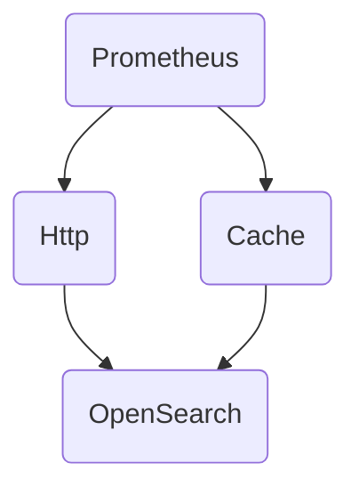
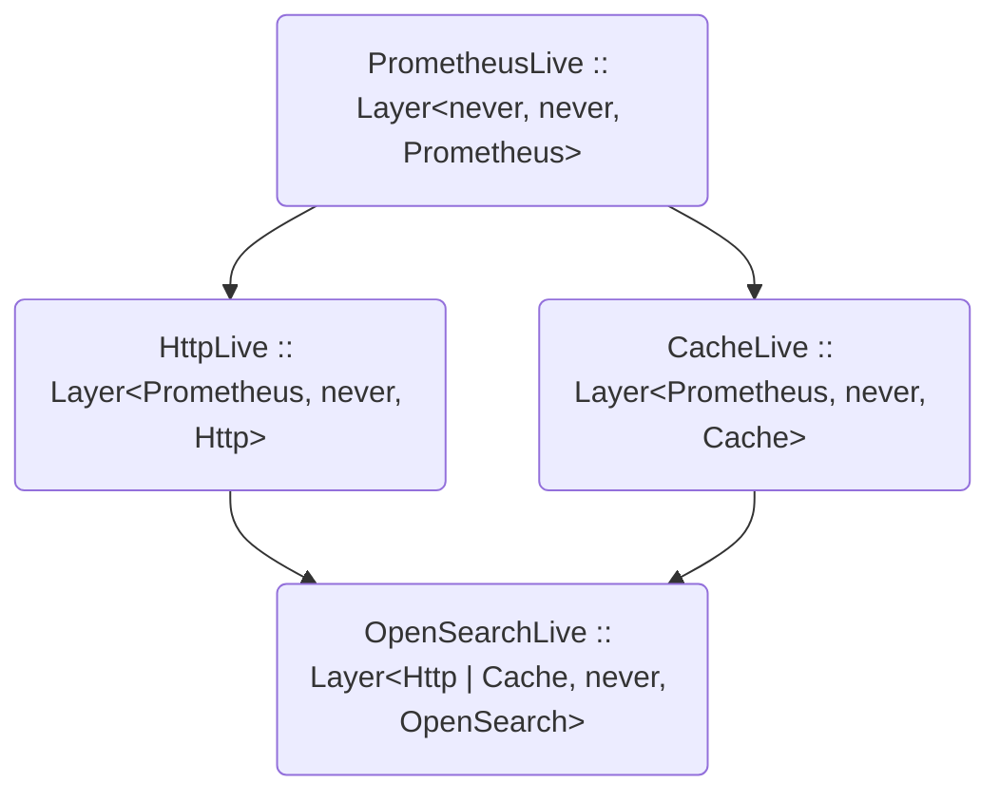
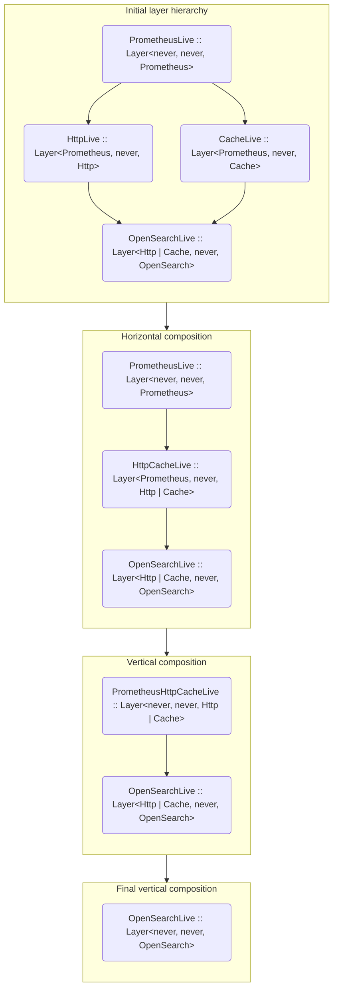

When we're writing programs, we usually deal with some kind of dependencies: databases, loggers, caches, telemetry... Setting up a full-blown Dependency Injection framework could be a solution to this, but Effect has some aces in its sleeves that make DI frameworks unnecessary. Let's see how we can manage dependencies using Effect.

<!--more-->

Intro to Effect series:
1. [What is Effect?](https://ybogomolov.me/01-effect-intro)
2. [Handling Errors](https://ybogomolov.me/02-effect-handling-errors)
3. Managing Dependencies
4. [Concurrency in Effect](https://ybogomolov.me/04-effect-concurrency)
5. [Software Transactional Memory in Effect](https://ybogomolov.me/05-effect-stm)

---

Let's recall the mental model of `Effect<R, E, A>`:

```ts
type Effect<R, E, A> = (context: R) => Promise<E ⋃ A>;
```

Today we'll be talking about the `(context: R) =>` part. In programming, we seldom are working with completely pure functions, except, probably, when writing a mathematical library. In many cases, our code is working _in some kind of context_ — e.g., it has access to some environmental variables, can log something, can query a database or send something via a network protocol. But when we're talking about functional programming, we want as many of our functions to be pure as possible. So how do we solve this conundrum?

The answer is well-known for many decades — we make our pure functions take their dependencies as extra parameters. To make it simpler, the dependencies are usually put _before_ the actual arguments of the function:

```ts
declare const functionWithDeps: (db: Database, logger: Logger) => (userId: UserId, startDate: Date, endDate: Date) => Result;
```

If you have read my "Intro to fp-ts" series, you already recognised the `Reader` pattern. When we refactor this function definition a little, we get the following declaration:

```ts
type Reader<R, A> = (env: R) => A;

interface Env {
  readonly db: Database;
  readonly logger: Logger;
}

declare const functionWithDeps: (userId: UserId, startDate: Date, endDate: Date) => Reader<Env, Result>;
```

The same mental model also applies to Effect — of course, with a note that it isn't implemented as an actual function, in contrast to `Reader` from `fp-ts`.

In Effect, we're talking about _services_. Each service is an entry in a _context_ represented by the `R` parameter of `Effect<R, E, A>` type. Let's see how we can declare, use, and instantiate a service in Effect.

## Declaration Of A Service

To declare a service, you need to use the `Context` module. Each service is _tagged_ using a unique tag that helps differentiate different services on the type level:

```ts
import { Effect, Context, Option } from 'effect';

interface DatabaseService {
  readonly getUser: (id: Id) => Effect.Effect<never, ConnectionError, Option.Option<User>>;
}

const DatabaseService = Context.Tag<DatabaseService>();
// or you can provide a `key` to make this dependency global (singleton):
const DatabaseService = Context.Tag<DatabaseService>('DatabaseService');
```

It is recommended to name the tag of a service and its interface the same — in this case, you can import both things using the same name. Moreover, you should _think_ of them as a single type — just like `zod` validators and inferred types, or `@effect/schema` schemas and their inferred types. This may sound a bit controversial, but when you think about it a bit, it becomes logical and crystal clear. We already have one entity in the TypeScript type system that operates on both type and value levels — the `class` keyword. If you squint a bit, you'll see that both schemas and their inferred types _are_ the same, so it is logical to name them the same. Similar reasoning applies to Effect services as well — a service interface and its `tag` should be seen as the same thing.

You can think of `Context` as a hashmap of `Tag -> Service implementation`. When you access a service, you're just adding a new entry to that hashmap — and when you finally want to interpret your expression, you need to provide implementations of all services.

### Layers

Now, what if we want to create a service that is also dependent on another service? For example, a service for OpenSearch may be dependent on both an `Http` service and a `Cache` service, both of which depend on a `Prometheus` service to add some observability:



The Effect library has a recipe to solve this issue as well in the form of _layers_. A `Layer<In, E, Out>` is a blueprint for building a `Context<Out>`. To create a layer with no dependencies, we use `Layer.succeed`.

> **Note**: there is a convention taken from ZIO that production-ready layers have suffix `Live`, and all others (mostly, built for testing purposes) do not have such suffix.

```ts
import { Effect, Context, Layer } from 'effect';

interface Prometheus {
  readonly register: (name: string, value: number) => Effect.Effect<never, never, void>;
}
const Prometheus = Context.Tag<Prometheus>('myapp/prometheus');

const PrometheusLive = Layer.succeed(
  Prometheus,
  Prometheus.of({
    // actual implementation is irrelevant here, so I'll just `succeed` it:
    register: (name: string, value: number) => Effect.succeed(undefined),
  })
); // :: Layer<never, never, Prometheus>
```

Now, to create a layer that _depends_ on another layer, we use `Layer.effect`, because asking for a `Tag` in an effectful operation:

```ts
interface Http {
  readonly get: (url: string) => Effect.Effect<never, never, string>;
}
const Http = Context.Tag<Http>();

const HttpLive = Layer.effect(
  Http,
  Effect.map(Prometheus, prometheus =>
    Http.of({
      // exact implementation is also irrelevant here:
      get: url => Effect.succeed('42').pipe(Effect.tap(() => prometheus.register(url, 0))),
    })
  )
); // :: Layer<Prometheus, never, Http>
```

The same goes with the `Cache` layer — it is also dependent on `Prometheus`, so it will be created using the same template:

```ts
class CacheError {
  readonly _tag: 'CacheError' = 'CacheError';
}

interface Cache {
  readonly get: <T>(key: string) => Effect.Effect<never, never, Option.Option<T>>;
  readonly set: <T>(key: string, value: T) => Effect.Effect<never, CacheError, void>;
}
const Cache = Context.Tag<Cache>('myapp/cache');

const CacheLive = Layer.effect(
  Cache,
  Effect.map(Prometheus, p =>
    Cache.of({
      get: key => Effect.succeed(Option.none()).pipe(Effect.tap(() => p.register(key, 0))),
      set: (key, _value) => Effect.succeed(undefined).pipe(Effect.tap(() => p.register(key, 0))),
    })
  )
); // :: Layer<Prometheus, never, Cache>
```

Note that I created `Prometheus` and `Cache` layers as singletons (global services), and `Http` is not global, because in general, we do not want to share the HTTP abstraction instances.

To create our final layer, `OpenSearch`, we will just add another `Tag` into our effectful layer creation process:

```ts
interface OpenSearch {
  readonly search: <T>(
    model: Schema.Schema<T, T>,
    query: string
  ) => Effect.Effect<never, ParseError | CacheError, T>;
}

const OpenSearch = Context.Tag<OpenSearch>();

const OpenSearchLive = Layer.effect(
  OpenSearch,
  Effect.gen(function* (_) {
    const [http, cache] = yield* _(Effect.all([Http, Cache]));

    return OpenSearch.of({
      search: <T>(model: Schema.Schema<T, T>, query: string) =>
        Effect.gen(function* (_) {
          const maybeResult = yield* _(cache.get<T>(query));

          return yield* _(
            maybeResult.pipe(
              Option.match({
                onNone: () =>
                  Effect.gen(function* (_) {
                    const searchResult = yield* _(http.get(`/search?q=${query}`));
                    const parsed = yield* _(Parser.parse(model)(searchResult));
                    yield* _(cache.set(query, parsed));

                    return parsed;
                  }),
                onSome: Effect.succeed,
              })
            )
          );
        }),
    });
  })
); // :: Layer<Http | Cache, never, OpenSearch>
```

> I want to stop for a bit and talk about why `Layer` has a covariant `In` parameter (and, coincidentally, why `Effect` is covariant on its `R` param as well). This may feel illogical and just wrong, so here I'll provide my own understanding of this whole situation — maybe, it will help the Effect model to click with you.
>
> If you open [ZIO](https://zio.dev) documentation, you'll see that it is *contra*variant on its `R` param, so combining `ZIO[R1, E1, A]` and `ZIO[R2, E2, B]` will yield `ZIO[R1 & R2, E1 | E2, C]`. For ZIO, a [ReaderTaskEither](https://ybogomolov.me/04-tasks#readertaskeitherr-e-a--a-task-which-runs-in-the-context-of-some-environment) model works perfectly fine:
> ```scala
> type ZIO[R, E, A] = R => Either[E, A]
> ```
> But this is not the case for Effect — its environmental parameters are *co*variant, so combining `Effect<R1, E1, A>` and `Effect<R2, E2, B>`, you'll get `Effect<R1 | R2, E1 | E2, C>`!
> 
> Motivation for this is quite pragmatic, but not that obvious: in TypeScript, it is relatively easy to exclude one member of a _union_ from it, but it is rather hard to exclude a part of _intersection_.
> That's why in Effect, all context/environment parameters are _phantom_ and modelled using unions instead of intersections.
>
> **❗️ A rule of thumb**: when you look at `R1 | R2`, do not read it as "R1 or R2", but rather as "R1 plus R2" (closer to type-theoretic meaning). So when you see an `Effect<R1 | R2, E, A>`, you should understand it as a computation that can fail with an error of type `E`, produce a value of type `A`, **and requires both `R1` and `R2` (R1 + R2) dependencies present in the context** to be executed.

Now, you might be confused with everything that's going on here — services, layers, why do we need _that much_ abstraction just to work with dependencies? Hold tight, in a moment you'll see the benefits this approach brings, but first let me show how to access services in your effectful code.

## Using Services

When you have access to service `Tag`, you can just _ask_ for a service instance, and you'll get it in your pipeline:

```ts
const program = Effect.gen(function*(_) {
  const openSearch = yield* _(OpenSearch); // <-- accessing a service via Tag

  const foundUser = yield* _(openSearch.search(Schema.unknown, 'user'));
  //                         ^^^^^^^^^^^^^^^^^ using a service instance

  yield* _(Effect.log(`Found user: ${foundUser}`));
}); // :: Effect<OpenSearch, CacheError | ParseError, void>
```

Observe how bringing into program context and using a service automatically pulls its `Context` (`R`) and `Error` (`E`) types.

## Providing Service Implementations

If you try running the `program` expression that we've built, you'll find out that you can't do this without providing a valid service implementation:

```ts
Effect.runPromise(program); 
//                ^^^^^^^ Argument of type 'Effect<OpenSearch, never, void>' 
//  is not assignable to parameter of type 'Effect<never, never, void>'
```

We could do this using `Effect.provideService` and `Effect.provideServiceEffect` function, but that would be a very, VERY tedious and wordy process:

```ts
Effect.runPromise(
  program.pipe(
    Effect.provideServiceEffect(
      OpenSearch,
      Effect.gen(function* (_) {
        const [http, cache] = yield* _(Effect.all([Http, Cache]));

        return OpenSearch.of({
          // the exact implementation we've used in OpenSearch layer
        });
      })
    ),
    Effect.provideServiceEffect(
      Cache,
      Effect.map(Prometheus, p =>
        Cache.of({
          // the exact implementation we've used in Cache layer
        })
      )
    ),
    Effect.provideServiceEffect(
      Http,
      Effect.map(Prometheus, prometheus =>
        Http.of({
          // the exact implementation we've used in Http layer
        })
      )
    ),
    Effect.provideService(
      Prometheus,
      Prometheus.of({
        // the exact implementation we've used in Prometheus layer
      })
    )
  )
);
```

To make this more manageable, we will put those layers we've built to use.

### Composing Layers

The power of layers hides in their composition. Recall the service structure that we've built as layers:



To resolve this hierarchy into a single "provideable" layer, we need to compose them _vertically_ and _horizontally_. 

Let's start with vertical composition. To satisfy the requirements of `Http` and `Cache` layers, we can use `Layer.provide` to build our composition:

```ts
const HttpResolvedLive = PrometheusLive.pipe(
  Layer.provide(HttpLive)
); // :: Layer<never, never, Http>
const CacheResolvedLive = PrometheusLive.pipe(
  Layer.provide(CacheLive)
); // :: Layer<never, never, Cache>
```

Observe that after such composition we have eliminated `Prometheus` from dependencies of both `HttpLive` and `CacheLive` layers. Now we can use those layers to gradually resolve dependencies of `OpenSearchLive`:

```ts
const OpenSearchPartiallyResolvedLive = HttpResolvedLive.pipe(
  Layer.provide(OpenSearchLive)
); // :: Layer<Cache, never, OpenSearch>
const MainLive = CacheResolvedLive.pipe(
  Layer.provide(OpenSearchPartiallyResolvedLive)
); // :: Layer<never, never, OpenSearch>
```

That was a very inefficient way of building layers, I should say 😉 Thankfully, we have also a _horizontal_ composition of layers using `Layer.merge` function that allows us to build the resulting `MailLive` layer simply and elegantly:

```ts
const HttpAndCacheLive = Layer.merge(CacheLive, HttpLive); // :: Layer<Prometheus, never, Http | Cache>

const MainLive = PrometheusLive.pipe(
  Layer.provide(HttpAndCacheLive), // :: Layer<never, never, Http | Cache>
  Layer.provide(OpenSearchLive)
); // :: Layer<never, never, OpenSearch>
```

This could be visualised as:



Now, we can provide our `MainLive` layer to our `program` and finally run it:

```ts
Effect.runPromise(Effect.provideLayer(program, MainLive)); // :: Promise<void>
```

# Conclusion

At first, thinking about services and layers might be a bit overwhelming. I find it helpful to visualise my dependency graphs to understand better how my programs should be built. But in the end, I think the concept of layers is very useful, as it helps isolate core business logic from service implementation and it sets up a pretty decent dependency injection approach without all those implicit factories, registries, and service locators.

If this analogy helps, you can think of composing layers as [Arrow-based programming](https://en.wikipedia.org/wiki/Arrow_%28computer_science%29) — e.g., if you have worked with [RxJs](https://rxjs.dev), you already have experience composing arrows.
